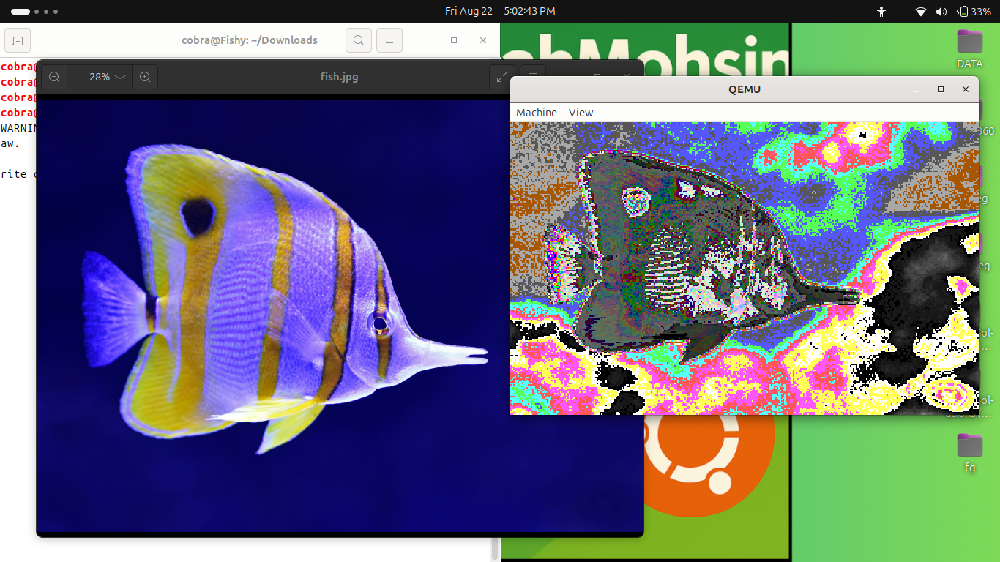

# AbdullahMohsinU - Image Rendering in Assembly (NASM) | Fish in Water GUI in QEMU

#imagerendering  #GUI #BMP #IMAGE-RENDERING-ASSEMBLY #NASM

## Overview
I conducted an experiment to understand how image rendering actually works using Assembly (NASM). This project demonstrates rendering a fish in water using a graphical interface in QEMU.
## SCREENSHOT OF IMAGE

